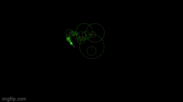
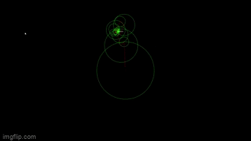

# My Personal Processing Projects
## This is a repositories of various projects I made in my free time using a tool called [Processing 4.0.1](https://processing.org/download). 
### You can download them and run them/tinker with them in Processing, or watch the results of my favorites in gif form below:
## Complex Fourier Series

