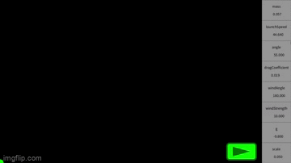

# My Personal Processing Projects
## This is a repositories of various projects I made in my free time using a tool called [Processing 4.0.1](https://processing.org/download). 
### You can download them and run them/tinker with them in Processing, or watch the results of my favorites in gif form below:

## Complex Fourier Series

### This program takes a shape as input(Mario and Pi in these cases) and calculates it's complex fourier series and visualizes it. Essentially what's happening is there are a series of vectors rotating at constant speeds and when you add them together they create an interesting shape. You can see the input files [here](https://github.com/Stephen-Schuster/ProcessingProjects/tree/main/Processing/fourier/data) and you can put any valid png here.

## Julia Set Demonstration

### [The Julia Set](https://en.wikipedia.org/wiki/Julia_set) is a set of fractals. This program visualizes the set, taking the user's mouse position as input

## Projectile Physics Demonstration

### This program demonstrates the movement of a projectile with airdrag and wind. Many of the factors can be edited to change the outcome.

## Brownian Motion Demonstration

### This program demonstrates [Brownian motion,](https://en.wikipedia.org/wiki/Brownian_motion) a concept in physics that describes why groups of particles seem to expand even if there's no force driving it. All these particles are moving in random directions. Each direction is equally likely no matter where in the canvas they are. However, they still seem to expand outwards away from the center.
