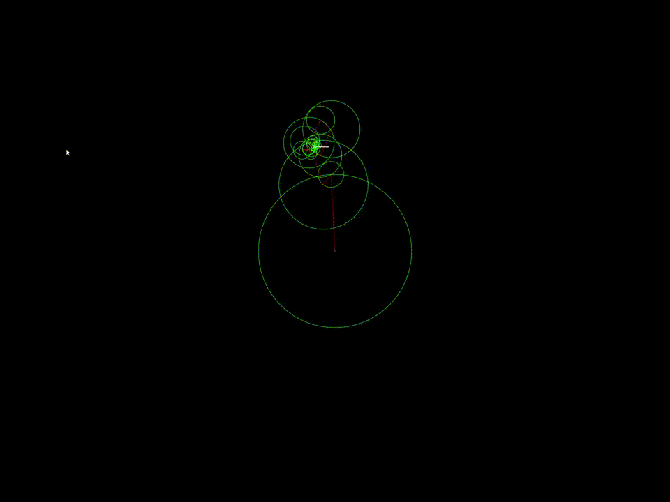

# My Personal Processing Projects
## This is a repositories of various projects I made in my free time using a tool called [Processing 4.0.1](https://processing.org/download). 
### You can download them and run them/tinker with them in Processing, or watch the results of my favorites in gif form below:

## Complex Fourier Series

This program takes a shape as input(Mario and Pi in these cases) and calculates it's complex fourier series and visualizes it. Essentially what's happening is there are a series of vectors rotating at constant speeds and when you add them together they create an interesting shape. You can see the input files [here](https://github.com/Stephen-Schuster/ProcessingProjects/tree/main/Processing/fourier/data) and you can put any valid png here.

##
